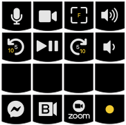

# A video conference and playback keymap for Sweet 16 macro pad from 1upkeyboards

Implements toggling outgoing audio and video, fullscreen, and controlling
system volume output for three video conference applications; namely
Facebook Messenger/Workplace Chat/Room, BlueJeans, Zoom.

Switching key functions between VC applications is implemented via layer
keys at the bottom row of the board. Single key press switches to dedicated
layer until another layer is selected.

Also implements essential video playback controls to toggle between playing
& pausing, one shot rewind & forward, independent of currently selected
layer via the three leftmost keys on the second row.

A YouTube specific super layer--momentarily activated with bottom rightmost
key--shifts the step size for forward and rewind keys.

Notes:
- Volume Control
  Toggling mute state for the system output volume is implemented key
  chording. Press volume up and volume down buttons at the same time to
  trigger mute/unmute media control keycode.

- Fullscreen
  Currently BlueJeans doesn't have a keyboard shortcut for toggling
  fullscreen mode so this button is not functional when BlueJeans layer is
  active.

  YouTube and a few other video playback applications use 'F' to toggle fullscreen.
  Support for this is implemented in the superior layer of the
  fullscreen key, activated with holding down bottom row rightmost key.

- Third Row
  Currently no functionality is assigned to the keys on the third row.
